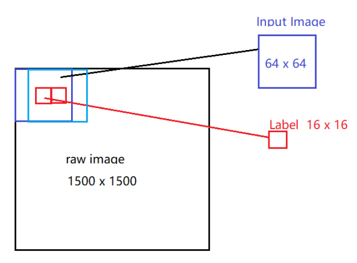
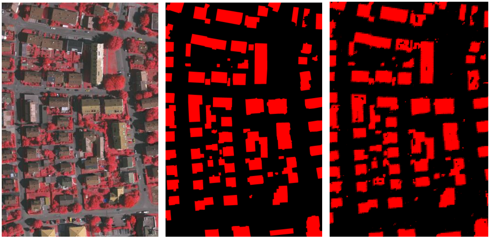

Compare simple CNN and ResNet for building extraction with tensorflow. Out of date, but interesting trial.

### Data

[Massachusetts building dataset](https://www.cs.toronto.edu/~vmnih/data/)

[ISPRS dataset](http://www2.isprs.org/commissions/comm3/wg4/tests.html)

Each big tile (e.g. 1500*1500) is overlap-cropped to 64*64 patches with stride 16. The center 16*16 sub-patch is the label of the patch.

### Model

At this time, no fully convolutional networks were used. The model (CNN or ResNet) has a final fully connected layer with output shape (B,256,2). In other words, the center sub-patch is flattened and each pixel is classified.

### Result

Interesting sawtooth effect. From left to right: RGB image, groud truth, prediction.

### Discussion
**note:** Not yet fully convolutional network based sementic segmentation, out of date, but interesting trial.

